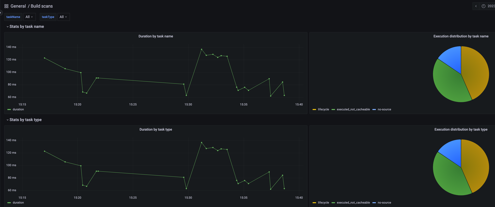

# gradle-task-monitor

_Grafana_ / _InfluxDB_ based solution to display cross build statistics on _Gradle_ tasks / _Maven_ goals.
Build information are fetched from Gradle Enterprise API (a running [Gradle Enterprise](https://gradle.com/) instance is therefore required).

The API is not meant to be consumed at a large scale and build scans should be filtered accurately. 
In order to do so, the request to fetch the build scans is parameterized:
- `query`: builds matching the advanced query only will be fetched (up to 1000 builds maximum)

Check the [documentation](https://docs.gradle.com/enterprise/api-manual/ref/2023.3.html) for more details.

In the background, _docker-compose_ is used to orchestrate the different components.
A third container (_runner_) is additionally spawned to ease the data population / deletion process.

# Usage

- Initialize the system:
```bash
> docker-compose up -d
```

- Populate data into the system:

```bash
> GRADLE_ENTERPRISE_URL=https://gradle-enterprise.com
> GRADLE_ENTERPRISE_TOKEN=my-secret-token
# Unix timestamp in ms
> QUERY=""buildStartTime > -1d and project:common-custom-user-data-gradle-plugin"
> docker exec runner /home/runner/collect-data.sh ${GRADLE_ENTERPRISE_URL} ${GRADLE_ENTERPRISE_TOKEN} ${QUERY}
```

- Delete all data from the system (delete InfluxDB bucket):
```bash
> docker exec runner /home/runner/delete-data.sh
```

# Rendering

open the Grafana dashboard on http://localhost:3000/


